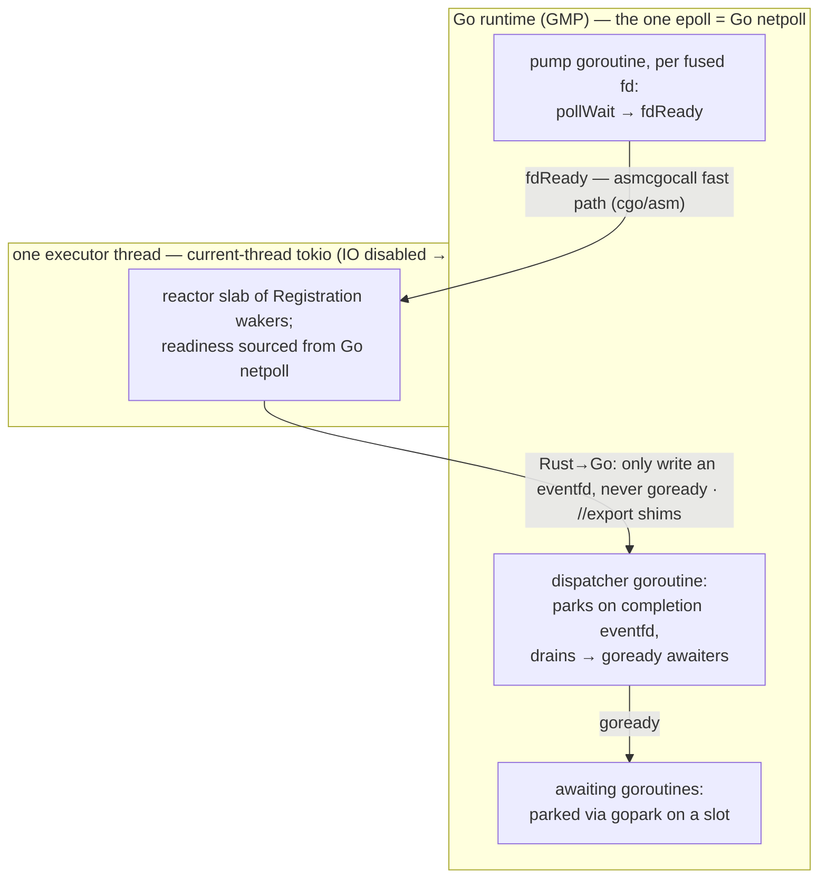
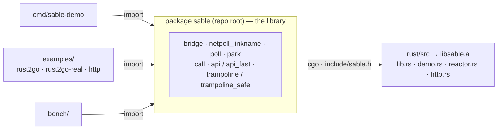

# Sable — fusing Rust/tokio onto Go's M:N scheduler


A proof-of-concept that fuses a Rust **tokio** async runtime with Go's **M:N (GMP)
goroutine scheduler** into a **single shared OS event loop**, demonstrating
**symmetric mutual await**: a goroutine can `await` a Rust async result, and a
tokio task can `await` a Go result — each *without* dedicating a blocked OS
thread and without busy-polling.

To the best of the survey behind this project, no existing work fuses these two
runtimes at the scheduler level (rust2go keeps two separate reactors; UniFFI
polls from the foreign side but tokio still runs its own reactor; go-lib
reimplements GMP in Rust with no tokio). Sable occupies that gap.

- **Toolchain:** Go 1.26.4, Rust 1.96, Linux — a single static binary (cargo
  staticlib + cgo).
- **Portable:** runs on any 64-bit arch (amd64, arm64, riscv64, ppc64le, s390x,
  loong64, …) with **no arch-specific source**. Execution-verified on **arm64**
  (native) and **amd64** (cross-built static-musl, run under `qemu-x86_64`) — the
  full suite passes on both, including `-race`, the single-epoll assertion, and
  the stress tests.
- **Status:** the core fusion, generic API, cancellation, observability,
  backpressure, graceful shutdown, formal/fuzz/Miri verification, a portable
  zero-linkname fallback, and a platform-abstracted doorbell are all implemented
  and tested. See [What works today](#what-works-today), [Performance](#performance),
  and [Limitations & gaps](#limitations--gaps). The chronological development log
  lives in [`JOURNAL.md`](JOURNAL.md).

## The core idea

Stock tokio hides its `mio` epoll and offers no manual reactor turn, so you
cannot drive/nest its reactor from Go. Instead of forking tokio, Sable **removes
tokio's reactor**: the runtime is `Builder::new_current_thread().enable_time()`
with **no `enable_io()`**, driven by one dedicated executor thread doing
`block_on`. With no IO driver, tokio owns **zero epoll** and parks on a
futex/condvar. **Go's netpoll becomes the one and only epoll in the process** —
asserted by `TestSingleEpoll` scanning `/proc/self/fd`. tokio still provides its
scheduler, `Waker` protocol, `spawn`, and combinators.



**The correctness lynchpin:** `gopark`/`goready` are legal only on a real Go M.
The Rust executor thread is a raw pthread — it must **never** call `goready`. So
Rust→Go completions only `write()` an eventfd owned by Go's netpoll; the actual
`goready` happens inside the Go **dispatcher goroutine** (a real M). Go→Rust
crossings ride cgo/asm, where Go always has a valid `g`/`M`.

### How the fusion is layered

The fusion was built as reversible build-flag layers over a correct baseline;
each is still individually selectable, and the whole suite passes identically
with the fast paths on or off.

| Layer | What it adds | Seam |
|---|---|---|
| Baseline | Symmetric mutual await, stock APIs only | eventfd bridge (2 epolls) |
| Single epoll | **One shared epoll** | `//go:linkname poll_runtime_poll*` + pump goroutines |
| Direct park | Direct park/unpark of awaiters | `//go:linkname gopark`/`goready` |
| Fast crossing | Hot crossing skips `entersyscall` | `//go:linkname runtime.asmcgocall` |
| Guard rails | leak/teardown/single-epoll-under-load tests | — |

Build with **`-tags sable_safe`** to replace the asm fast path with the plain cgo
crossing — the permanent correctness backstop. Build with **`-tags sable_portable`**
(Rust `--no-default-features`) to drop *all* linkname and asm for a channel-based
backend that runs on any toolchain (see [Limitations & gaps](#limitations--gaps)
and [Portability](#portability)).

## What works today

The core proves the fusion with small futures; the surface around it is what a
library would actually expose. All of the following are implemented and tested.

| Capability | Entry points | Notes |
|---|---|---|
| Symmetric mutual await | `AwaitRust`, `RustAwaitsGo` | goroutine ⇄ tokio task, no blocked thread |
| Single shared epoll | (automatic) | `TestSingleEpoll`; custom `GoAsyncFd` path only |
| Generic byte-buffer call | `Call(op, req)` | arbitrary async Rust op; caller owns serialization |
| Pluggable handler registry | `register`, `register_stream` (Rust) | embedder hosts its own `op → async handler`; demo ops become one registrant |
| Zero-copy handle result | `CallHandle(op, req)` | handler returns an opaque pointer (e.g. an Arrow stream); Go takes ownership, single free |
| Streaming call | `OpenStream`, `Stream.Next/Close` | lazy per-batch pull via repeated awaits — no `block_on` |
| Multi-thread executor | `-features multithread` | IO-disabled parallelism for CPU-heavy handlers; single-epoll invariant preserved (validated) |
| Embedder-owned staticlib | `-tags sable_extern_lib` | link sable's runtime into a larger combined Rust lib |
| Cancellation | `CallCtx(ctx, op, req)` | ctx-cancel aborts the tokio task, exactly-once completion |
| Observability | `RuntimeStats()` | lock-free Rust-side counters/gauges |
| Backpressure | `SetMaxInFlight`, `TryCall` | CAS admission; `ErrBackpressure` at cap |
| Graceful shutdown | `Shutdown()` | ordered teardown, no fd/goroutine leak |
| Inline fast await | `sable_future_*` (`inline.go`) | non-suspending awaits stay on one M |
| Go-M task execution | `goexec` | tokio tasks run under Go's Ms |
| Portable fallback | `-tags sable_portable` | zero-linkname channel backend |
| Real ecosystem app | `-tags sable_http` | reqwest + axum over the fusion |

### Generic byte-buffer call

Beyond the demo-shaped `u64`/`kind` calls, `Call(op, req []byte) ([]byte, error)`
(`call.go`) awaits an **arbitrary Rust async operation**, marshalling request and
response as **byte buffers** — the caller serializes its own types (JSON /
protobuf / bincode / …); the transport just moves bytes plus an ok/err flag. The
ownership contract is explicit: the result is a Rust-owned buffer that Go copies
out (`C.GoBytes`) and then frees (`sable_call_free`) — single owner, single free.
Handlers are genuine futures (one built-in op suspends on a timer). It is CORE
(spawn + doorbell only), so it works under the fast *and* the zero-linkname
portable backends. Verified under `-race`, including 1k concurrent calls with
unique payloads.

The built-in ops are one *registrant* of the handler registry, not a fixed set —
see below.

### Embedding: pluggable handlers, opaque handles & streaming

The Call path is built for **embedding**: a crate that depends on sable can host
its *own* async operations and hand Go *opaque handles* (not just bytes), which is
what a zero-copy Arrow binding needs. All three pieces are additive — they ride the
existing `(token, u64)` completion and touch neither the doorbell, the park state
machine, nor the single-epoll invariant.

- **Pluggable handler registry (Rust: `register` / `register_stream`).** Instead of
  a compiled-in `dispatch`, the embedder registers `op → async handler`. A handler
  is any `Fn(Vec<u8>) -> impl Future<Output = HandlerResult>`; `Call`/`CallCtx`/
  `TryCall` look up the registry first and fall back to the demo ops (gated behind
  the `demo` feature). The demo ops are just one registrant.

  ```rust
  sable::register(OP_QUERY, |req| async move { run_query(req).await });   // Ok(Payload::Bytes) | Err(bytes)
  ```

  **Registration contract.** Handlers are registered from Rust (in the combined
  staticlib crate), and registration must happen **before the first Call** for that
  op — typically from an exported init the binding's Go calls before `sable.Init`.
  An unregistered op is not a crash: it returns a normal error (`"unknown op N"`) on
  every path, so a missed registration surfaces as a clear error, not UB.

- **Zero-copy handle result (`CallHandle`, `CallHandleCtx`).** A handler may return
  `Payload::handle(ptr, release)` — an opaque pointer (e.g. a
  `*mut FFI_ArrowArrayStream`) sable delivers verbatim as the `u64` result. Go takes
  ownership with `CallHandle`, which disarms sable's **release-on-drop net** (a
  `token → release` map swept on shutdown, mirroring the cancellation guard) so the
  pointer is freed exactly once — by Go on the normal path, by sable if Go never
  takes it. On a `0` result the handler's **error is delivered without re-running**
  the op (`sable_call_handle_error`). `CallHandleCtx` adds ctx cancellation.

  ```go
  ptr, err := sable.CallHandle(OP_QUERY, req)   // ptr is Go-owned; drive its own release (e.g. cdata)
  ```

- **Streaming call (`OpenStream` / `Stream.Next` / `NextCtx` / `Close`).** For results
  that must not be materialized whole, a stream handler is a producer that pushes
  each batch into a bounded channel; Go opens a server-side cursor and pulls **one
  batch per await** — the goroutine parks between batches, so async `get_next` needs
  no `block_on` and blocks no M. The bounded channel is the backpressure; `OpenStream`
  is additionally admission-controlled (`SetMaxInFlight` caps concurrent live
  streams, returning `ErrBackpressure`). `NextCtx` cancels a parked pull; `Close`
  aborts the producer (dropping whatever it pinned) and releases buffered batches.

  ```go
  s, _ := sable.OpenStream(OP_QUERY, req)
  for { ptr, ok := s.Next(); if !ok { break }; use(ptr) /* Go-owned batch */ }
  s.Close()
  ```

### Ownership & lifetimes across the boundary

Every blob crossing the FFI has exactly one owner at a time and a single free.
Summary, then the rules per transport:

| Blob | Allocated by | Freed by | Lifetime window |
|---|---|---|---|
| **Request bytes** (all paths) | Go | Go (GC) | Borrowed by Rust only *during* the spawn call — copied synchronously, so Go may reuse/free it the instant the call returns |
| **Response buffer** (`Call`) | Rust (`Box<CallResult>`) | Rust (`sable_call_free`) | Rust-owned from completion until Go copies it out and frees it; the `[]byte` handed back to the caller is a Go copy |
| **Opaque handle** (`CallHandle`) | the handler (opaque) | Go, or sable's net | Delivered armed; Go's `handle_taken` transfers ownership (Go then drives the object's own release), or sable releases it on shutdown if never taken |
| **Cursor id** (`OpenStream`) | Rust (registry entry) | Rust (`Close`/shutdown) | An opaque id, not a pointer; valid until `Close` or teardown |
| **Stream batch** (`Stream.Next`) | the handler (opaque) | Go, or sable's net | Same as a handle, per batch; buffered-but-unpulled batches are released by `Close`/shutdown |

**Request bytes — borrowed, then copied.** Go passes `req` by pointer; every spawn
entry copies it (`slice::from_raw_parts(..).to_vec()`) *before* returning, and Go
holds the buffer alive for that window with `runtime.KeepAlive`. After the call
returns, Rust has its own copy and Go's buffer is free to mutate or collect — no
shared ownership of request memory ever outlives the call.

**Response bytes — Rust owns, Go borrows then frees.** The result is a Rust-owned
`Box<CallResult>` delivered as a `u64` handle. Go reads `(ok, ptr, len)` without
transferring ownership (`sable_call_result`), copies the bytes out (`C.GoBytes`),
then frees the box (`sable_call_free`). Single owner (Rust) → borrow → copy → free.
The pointer is invalid the instant `sable_call_free` runs; the returned `[]byte` is
an independent Go allocation.

**Opaque handle — single owner, single free, with a safety net.** A handler returns
`Payload::handle(ptr, release)` (a self-releasing `Handle`); sable records
`token → (ptr, release)` **before** delivering `ptr`, so the pointer is always
accounted for. Then exactly one of:

- *Taken* — `CallHandle` calls `sable_call_handle_taken(token)`, which drops the map
  entry **without** calling `release`. Go now solely owns `ptr` and must drive its
  release itself (for an Arrow stream, `cdata.ImportCArrayStream` calls the stream's
  release callback on `reader.Release()`). sable holds no further reference.
- *Never taken* — on shutdown, `drain_armed_handles` calls `release(ptr)` exactly
  once for every still-armed entry (the same publish-on-drop discipline as the
  cancellation guard). So an abandoned handle is freed by sable, never leaked.

The contract: **take before teardown** any handle you intend to use. `handle_taken`
and the shutdown sweep are mutually exclusive (taken removes the entry), so a handle
is freed once and only once. A `0` result means no handle: nothing is armed and
`handle_taken` must not be called — the handler's error is retrievable without
re-running the op via `sable_call_handle_error` (or, for `CallHandleCtx`, `0` +
`ctx.Err()` means cancelled). And because `Handle` releases on drop, a `Payload`
that is *never* delivered — dropped as a buffered batch, held by an aborted
producer, or misrouted to the byte path — still frees its pointer exactly once.

**Stream batches — the handle rules, per batch, plus close/drain.** Each batch is a
`Payload::Handle` flowing through a bounded channel; `Stream.Next` delivers it armed
and takes ownership exactly like `CallHandle`. The extra lifetimes are the cursor
itself and unpulled batches:

- The **cursor** is a Rust-side registry entry keyed by an opaque `u64` id (not a
  pointer Go dereferences). `Close` removes it, aborting the producer task — which
  drops the DataFusion stream/future and releases the snapshot/segments it pinned.
- **Buffered-but-unpulled batches** (produced into the channel but not yet `Next`-ed
  when you `Close`) are drained and released by sable. Delivered-but-not-taken
  batches are covered by the same shutdown net as one-shot handles.
- **Boundary to know:** a batch the producer had *exported to a raw pointer* but not
  yet sent when it is aborted relies on that future's own `Drop` to release the
  underlying resource — sable only guarantees release of batches that reached the
  channel. Handlers should export a batch immediately before `send` (the DataFusion
  data it holds until then is freed by the aborted future's `Drop`).

Do not `Next` after `Close`; iterate a stream from a single goroutine.

### Cancellation

`CallCtx(ctx, op, req)` (`call.go`) cancels an in-flight op when `ctx` is cancelled
— a watcher goroutine calls `sable_call_cancel`, which aborts the tokio task
(`AbortHandle::abort`), dropping its future so its `Drop` runs (releasing fds etc.).
A **publish-on-drop guard**, captured *by* the future so its `Drop` runs even for a
never-polled abort, guarantees exactly one completion — the real result on normal
finish, or a cancellation sentinel — so there is no double-wakeup, no orphaned
result buffer, and no registry leak. Verified: 500 concurrent cancels drain to 0
pending; a 10s op cancels in ~50ms with `context.Canceled`.

### Observability

`RuntimeStats()` (`stats.go`) returns a snapshot of Rust-side counters — `Spawned`,
`Completed`, `Cancelled`, `InFlight`, `QueueDepth`, `PeakQueueDepth`,
`CancelsRegistered`, `Rejected` — for export to metrics/pprof. Totals are
lock-free atomics incremented at the spawn/publish/cancel sites; the gauges read
the live completion queue and cancel registry. `InFlight` (spawned − completed) and
`PeakQueueDepth` are the producer-outpacing-consumer signals that motivate
backpressure. Core surface — works under both backends.

### Backpressure

Without admission control a Go producer can `Call` faster than tokio drains,
growing in-flight tasks (and their captured buffers) unbounded. `SetMaxInFlight(n)`
caps concurrent in-flight tasks; `TryCall(op, req)` returns `ErrBackpressure`
**immediately** at capacity — nothing spawned, nothing parked — so the caller
sheds load or retries instead of piling on. Admission is a lock-free CAS against
the live `in_flight` gauge, so the cap is never exceeded even under a burst
(`TestBackpressure`: 300 simultaneous callers, cap 4, gauge never peaks above 4,
no calls lost, refusals counted in `RuntimeStats().Rejected`). The unbounded entry
points (`Call`, `CallCtx`) still count toward the gauge but are never refused. Rust
splits pure transport (`publish`) from Call-style accounting (`complete`) so only
admitted tasks move the gauge — the inline/http paths never skew it. Core surface —
both backends.

### Graceful shutdown

`Shutdown()` (`shutdown.go`) tears the fused runtime down in an order that avoids
two hazards the PoC left open:

- **Use-after-free of `rt`**: the dispatcher goroutine dereferences the global `rt`
  in `drainCompletions`, so freeing the box while it runs would be a use-after-free.
  Shutdown splits teardown into `sable_runtime_shutdown` (abort in-flight tasks +
  join the executor, box stays valid) → close the doorbell so the dispatcher drains
  once more and exits → **only then** `sable_runtime_free`.
- **eventfd leak / double-close**: `Inner` had no `Drop`, so every runtime leaked
  its completion eventfd. Now Rust owns and closes it on drop, and Go polls a `dup`
  of it (`syscall.Dup` in `sableInit`) — each side closes its own descriptor.

`TestTeardownNoLeak` creates+frees 100 runtimes with tasks in flight and asserts
neither fds nor goroutines grow; `TestShutdownAndReinit` drives the full
shutdown→re-init cycle twice. The demo binary calls `Shutdown()` on exit.

### Two more ways to execute tokio tasks

The dedicated-executor design runs tokio on *one* thread — simple and the source
of the single-epoll property, but also the throughput ceiling and two cross-thread
wakeup hops of latency. Sable implements two alternatives that trade the single-epoll
property for speed (see [Performance](#performance) for numbers):

- **`goexec` (`rust/src/goexec.rs`)** — drives task execution from **Go's M:N
  scheduler**: `async-task` splits futures into `Runnable`s, and a pool of Go worker
  goroutines (one per P) polls them. Each task *completes on a Go M*, so it delivers
  its result with a **direct `goready`** — no completion doorbell, no dispatcher hop.
  The decisive detail is the wakeup primitive: parking workers in a Rust channel's
  blocking `recv` (opaque to Go's scheduler) measured 91µs conc-1 latency; parking
  each worker in Go's **netpoller** on its own per-worker eventfd doorbell dropped
  that to 4.4µs. Correct, leak-free, race-free under a 2M-await soak.

- **Inline fast path (`inline.go`, `sable_future_*`)** — the gap against pure tokio
  was that *every* await used the async spawn→park→cross-thread-wake→deliver path,
  even for futures that never suspend, paying a wakeup **syscall** and a cross-thread
  hop. The fix polls the future **inline on the goroutine's own M** and goes async
  only on genuine suspension: (1) poll once with a no-op waker (no alloc) — if
  `Ready`, return the value with no spawn, no gopark, no syscall, no other thread;
  (2) otherwise install a real token-keyed waker, `gopark`, and re-poll when it fires
  (via the existing netpoll-doorbell + `goready`). The no-op-first poll is safe
  because the real re-poll re-checks readiness, so a wake lost to the no-op is never
  lost. Verified correct, race-clean, leak-free under 4k concurrent suspending awaits
  + `GOGC=1`.

### Real-world scenario: reqwest + axum (`-tags sable_http`)

`rust/src/http.rs` proves the fusion holds with **full tokio ecosystem apps**:
**axum** (async HTTP server) and **reqwest** (async HTTP client) on a *separate*
multi-thread io-enabled tokio runtime that shares sable's completion delivery.

Why a separate runtime: reqwest/axum use `tokio::net` directly, which requires
tokio's own reactor — so this runtime enables IO and has its own mio epoll (two
epolls in this scenario). The single-epoll property is specific to the custom
`GoAsyncFd` path; what this shows is that the **fusion layer works unchanged with
real, complex async apps**:

- A **Go goroutine drives a reqwest GET** and parks via `gopark`, resumed via
  `goready` when the response arrives — Go's scheduler awaiting a real HTTP client
  with no thread blocked.
- The axum **`/go` handler calls back into Go** (`sable_go_double`, Rust→Go), so a
  request path crosses **Go → reqwest → axum → Go → back** — bidirectional fusion
  inside a live request.
- 200 concurrent goroutines drive reqwest→axum→Go with zero errors, under `-race`,
  on **both arm64 and amd64** (the latter under qemu).

```
make test-http              # cargo --features http (isolated target dir) + go test -tags sable_http -race
make http && ./sable-http   # run the demo
```

The http lib references the `sable_go_double` export, so it is built into a
separate target dir and never clobbers the lean core lib.

## Performance

Measured on **linux/arm64, Go 1.26.4, 20 cores**. Reproduce: `make bench` (crossing + end-to-end),
`SABLE_STRESS=1 go test -run 'TestScaling|TestSoak' -v` (stress), `make bench-pure` (the pure-tokio baseline).

### The one-epoll invariant

Exactly one `anon_inode:[eventpoll]` fd in the process (`TestSingleEpoll`), on the
custom `GoAsyncFd` path. Correct under `-race`, under `GOGC=1` (aggressive GC vs
parked state), and across 100k+ concurrent mutual awaits with zero
fd/goroutine/registry leaks.

The invariant survives a **multi-thread executor** too. The optional `multithread`
feature builds the runtime as `new_multi_thread().enable_time()` — no `enable_io()`
— giving CPU-heavy handlers real parallelism. `make test-multithread` empirically
confirms it creates **zero** epoll (the epoll is created by tokio's IO driver, which
`enable_io` installs, *not* by the multi-thread scheduler, whose workers park on a
condvar); the paired `enable_all`-plus-a-bound-socket control creates one, proving
the detector and the source. So the epoll count is a property of the IO driver, not
the thread count.

### FFI crossing cost (the hot path)

`fdReady`, fired per readiness event:

| path | ns/op | vs. |
|---|---|---|
| `asmcgocall` fast path | **~7.5** | ~4.5× faster |
| full cgo path | ~34 | skips two `entersyscall`/`exitsyscall` transitions + P re-acquire |

### Await latency & throughput — three execution strategies

The same immediate/CPU await, run three ways, against the pure-tokio baseline. The
inline fast path is the default for non-suspending awaits.

| strategy | conc-1 latency | trivial throughput | CPU-bound (~1µs task) |
|---|---|---|---|
| dedicated executor (1 tokio thread) | 12.0 µs | 1676 ns/op (~0.80M/s) | 3718 ns/op (~269k/s) |
| **goexec** (Go Ms) | **4.4 µs** | 1443 ns/op | **1318 ns/op (~759k/s)** |
| **inline fast** (compute, non-suspending) | — | **75 ns/op** | 147 ns/op (+~60ns work) |
| *pure tokio* (baseline) | ~0.26 µs | ~220 ns/op (~4.5M/s) | — |

- **Inline fast** *beats* pure-tokio `spawn().await` (~220 ns) at **75 ns/op** —
  **22× faster than the old spawn-based fusion** (1683 ns) — leaving only ~65 ns of
  FFI-crossing + poll setup. The suspending fallback is 4583 ns (1.6× faster than
  the old 7339 ns spawn-based suspend path).
- **goexec** beats the dedicated thread on latency **and** throughput: CPU-bound work
  parallelizes across cores, and completing on a Go M loses a delivery hop.
- **Dedicated executor** saturates by ~64 concurrent goroutines at **~800k awaits/sec**
  (~1.67 µs/op) and stays flat through **32,768** concurrent — the single-threaded
  tokio executor is the ceiling, by design:

  | concurrency | 1 | 8 | 64 | 512 | 4096 | 32768 |
  |---|---|---|---|---|---|---|
  | awaits/sec | 82k | 457k | 797k | 792k | 812k | 829k |

- **Both-directions** (Go→Rust→Go→Rust→Go, netpoll pump + eventfd): ~135k/sec.

### HTTP end-to-end (`-tags sable_http`)

Real loopback TCP + HTTP/1 + a tokio reactor per request:

| endpoint | req/sec | notes |
|---|---|---|
| `/ping` (sable) | ~120k | vs ~145k pure tokio → **~1.2× / ~16% overhead** |
| `/go` (bidirectional) | ~114k | Go → reqwest → axum → Go → back |

### Overhead vs pure tokio — the honest cost of the fusion

`make bench-pure` runs the *identical* workloads in pure tokio — no Go, no FFI, no
gopark/goready, no doorbell — so the delta is exactly the fusion boundary. Same
config per workload (current-thread for await, multi-thread for HTTP).

| workload | pure tokio | sable (dedicated) | overhead |
|---|---|---|---|
| spawn+await, **latency** (1 in flight) | ~260 ns | ~12 µs | **~46×** (cross-thread handoffs) |
| spawn+await, **throughput** (saturated) | ~4.5M/s | ~0.83M/s | **~5.4×** (~1 µs/op) |
| HTTP req/sec (`/ping`) | ~145k | ~122k | **~1.2×** (~16 %) |

Two honest takeaways:

- **Latency & trivial-compute throughput pay a real price** on the dedicated-executor
  path — each await crosses the FFI and takes *two* cross-thread wakeups plus
  `gopark`/`goready` (~1 µs of machinery, ~12 µs round-trip). The **inline fast path**
  and **goexec** exist precisely to close this: inline eliminates the spawn+hop for
  non-suspending awaits (75 ns, below pure-tokio parity), and goexec parallelizes
  CPU-bound work across Go's Ms.
- **Real I/O-bound work barely notices.** For HTTP the fusion is only ~16 % slower,
  because a request's cost (loopback TCP + hyper) dwarfs the boundary. The fusion is
  a poor fit for chatty nanosecond calls and a fine fit for the async I/O that async
  runtimes actually exist for.

### Stress, soak & leak

- **3M-await soak** (mixed, 4096 workers): zero wrong results; fds, goroutines, and
  the await/pump registries all return to baseline — no leaks.
- **Under `GOGC=1`** (1M awaits) and **under `-race`** (200k): clean, no leaks, no races.
- **goexec 2M-await soak** (`SABLE_STRESS=1 SABLE_EXEC=1 go test -run TestSoak`):
  leak-free, race-free.
- **amd64 under qemu**: 600k-await soak passes with no leaks — stress stability is not
  arch-specific.

## Limitations & gaps

What this PoC does *not* yet do, grouped by area. None are known correctness holes;
they are coverage/scope boundaries.

**Fundamental cost.** The dedicated-executor await path pays ~46× latency and ~5.4×
saturated-throughput vs pure tokio (above). The irreducible floor is **one FFI
crossing per await that enters Rust** — parity modulo the cost of being two languages.
The inline and goexec paths close most of the practical gap but do not remove that floor.

**Executor strategies are specialized.**

- **goexec** handles pure-compute futures only (no tokio reactor); uses round-robin
  dispatch rather than full work-stealing; and, being an *alternative* executor, does
  **not** carry the single-epoll property. I/O futures would additionally need a
  `Handle::enter()` guard so their leaf awaits use tokio's driver while scheduling
  stays on Go's Ms.
- **inline fast path** currently covers compute futures. *Planned:* run the inline poll
  under a `Handle::enter()` guard so `tokio::time`/`tokio::net` futures use tokio's
  reactor; route the inline crossing through the `asmcgocall` fast path; and replace
  the `sync.Map` registry + per-await `Box` with pools to shave the last ns.

**Single-epoll is path-specific.** It holds only on the custom `GoAsyncFd` path — not
the http scenario (uses `tokio::net`, so two epolls) nor goexec.

**Embedding surface is built; typed codegen is not.** The Call path is now a
user-populated registry (`register` / `register_stream`) that delivers bytes,
opaque handles, or lazy streams (see [above](#embedding-pluggable-handlers-opaque-handles--streaming)).
Handle and stream paths are cancellable (`CallHandleCtx` / `Stream.NextCtx`),
carry handler errors without re-running (`sable_call_handle_error`), and streams
are admission-controlled (`SetMaxInFlight`). Still open: a **typed codegen layer**
(uniffi-style) over the byte transport, and the **reverse direction** (Rust awaits
a Go handler), symmetric in principle but not built out.

**Cancellation is one-directional.** The reverse direction (Rust cancelling a Go
operation) and distinguishing a handler panic from a cancel are remaining refinements.

**Platform coverage.** Linux/amd64 + Linux/arm64 are certified for the full fast build.
macOS is code-complete pending certification on real hardware; Windows needs an IOCP
doorbell (portable fallback otherwise). The `/proc/self/{fd,status}` leak assertions are
Linux-only. See [Portability](#portability).

**Toolchain fragility.** Every linknamed symbol carries no compatibility promise, so
**any Go upgrade is an ABI re-audit**, gated by `make abi-check` (below).

## Verification

Sable's correctness rests on a foreign-thread wakeup handshake and a pile of
`unsafe`/g0-stack code. Beyond the functional + stress suites (`make test`, every one
under Go's `-race`), the concurrency and memory-safety cores are checked directly:

| Tool | What it proves | Runs on | Command |
|---|---|---|---|
| **Loom** | The await-slot park/deliver state machine is **lost-wakeup-free** and **exactly-once** under *every* thread interleaving and memory reordering. | stable Rust | `make loom` |
| **Go fuzzing** | The byte-buffer `Call` FFI marshalling (ptr/len crossing, `GoBytes` copy, Rust-side free) never crashes/leaks and its data ops round-trip, on arbitrary inputs. | stable Go | `make fuzz` |
| **Miri** | The raw-pointer lifecycle behind the `Call` ABI (`Box::into_raw` → read via `sable_call_result` → `sable_call_free`) is free of UB / leaks / double-frees. | nightly Rust | `make miri` |
| **Go `-race`** (TSan) | The Go half (park/deliver, dispatcher, pump, fd ownership) is data-race-free; every suite runs under it. | stable Go | `make test` |
| **Rust TSan** | The Rust half's atomics/wakers are race-free, validated **separately** from Go's TSan (two TSan runtimes in one process are unstable). | nightly Rust | see below |

**Loom — the wakeup protocol.** `rust/tests/loom_wakeup.rs` models `park.go`'s protocol
precisely: the awaiter's `parkCommit` does `CAS(IDLE→PARKED)` inside `gopark`; the
deliverer does `Xchg(→READY)` and, iff it observed `PARKED`, calls `goready`. Loom
explores every interleaving and asserts **committed park ⟹ goready fired exactly once**
and **park aborted ⟹ no goready fired** (the awaiter re-checks the result itself). A lost
wakeup here is a permanently hung goroutine, so exhaustive checking beats any amount of
stress iteration.

**Fuzzing — the FFI boundary.** `call_fuzz_test.go` (`FuzzCall`) drives arbitrary
`(op, bytes)` through the generic `Call` path; the seed corpus runs as ordinary tests
under every `go test`, and `make fuzz` extends coverage-guided (3M+ execs clean). The
oracle mirrors each Rust op's exact semantics (e.g. byte-wise `to_ascii_uppercase`, not
Go's UTF-8 `ToUpper`).

**Miri / Rust TSan (nightly).** Not in the default suite (this box has no nightly
toolchain); both are one command on a nightly host. The `unsafe` surface Miri targets is
deliberately concentrated in the core (`--no-default-features`) lib so it links with no
Go symbols present.

```sh
rustup toolchain install nightly
rustup +nightly component add miri
make miri                                   # UB-check the Call pointer lifecycle

# Rust-side TSan, in isolation from Go's race detector:
RUSTFLAGS="-Zsanitizer=thread" \
  cargo +nightly test --manifest-path rust/Cargo.toml --no-default-features \
  --target x86_64-unknown-linux-gnu call_unsafe_tests
```

Loom + fuzz run in CI on stable; Miri runs as a nightly, allowed-to-fail job.

### Key hazards navigated (see comments in the source)

- **`goready` from a foreign thread** is illegal → route Rust→Go wakes through an
  eventfd the netpoller owns (`park.go`, `bridge.go`).
- **Edge-triggered lost wakeups**: `pollReset` erases a latched `pdReady`; a write before
  `pollOpen` yields no edge → optimistic initial readiness + read-first (`poll.go`,
  `reactor.rs`, `lib.rs`).
- **fd-reuse race**: closing a fused fd before its netpoll registration is removed lets
  another task reuse the number and get its registration `pollClose`d out from under it →
  the **pump is the sole fd owner and closes it after `pollClose`** (`poll.go`).
- **g0-stack constraints**: `gopark`'s `unlockf` runs on g0 where sync/atomic race hooks
  and pointer write-barriers are invalid → `//go:norace`/`nosplit`/`nocheckptr` +
  `internal/runtime/atomic` + a bare-`uintptr` g pointer (`park.go`).
- **STW vs the fast path**: skipping `entersyscall` leaves the P `_Prunning`, so the
  crossing must stay short/non-blocking; verified under `GOGC=1` gctrace (bounded STW).

## Portability

### Go toolchains

This deliberately reaches into unstable runtime internals. `go.mod` pins `toolchain
go1.26.4`; **any Go upgrade is an ABI re-audit**, not a routine bump. The linknamed
symbols (`gopark`, `goready`, `poll_runtime_poll*`, `internal/runtime/atomic.*`,
`runtime.asmcgocall`) link under the default `-checklinkname=1` on 1.26.4 (verified absent
from the linker's blocked list). `go vet` flags the intentional
`unsafe.Pointer`↔`uintptr` conversions; they are guarded by `//go:nocheckptr`.

Support is **explicit and per-`(Go version × GOOS × GOARCH)`**, gated by automated ABI
certification. On any uncertified toolchain the runtime constructor **fails closed**
(running the fragile paths on an unverified ABI risks silent corruption); override with
`SABLE_ALLOW_UNVERIFIED_GO=1` only to certify a new version. The authoritative list is
`SupportedGoVersions` in `guard.go`.

| Go version | arch(es) verified | notes |
|---|---|---|
| go1.26.4 | linux/arm64 (native), linux/amd64 (qemu) | initial |

**Certifying a new release:** (1) install the toolchain and point `go.mod`'s `toolchain`
at it; (2) `make abi-check` runs the behavioral canaries — one per linknamed dependency
plus a symbol-presence check, each exercising the primitive directly so a failure names
the exact broken symbol; (3) if green, add the version to `SupportedGoVersions` and the
table above; (4) run `make test` and `make test-http` on it.

**When a release breaks a symbol:** a *signature/ABI change* (canary crashes or returns
garbage) means updating the linkname declaration to match — and re-auditing the
`//go:norace`/`nosplit`/`nocheckptr` assumptions if the g0-stack contract changed. A
*removed/blocked symbol* (link error) means finding the replacement internal, or shipping
the portable fallback below. *Silent semantic drift* (links, canary passes, behavior
differs) is the dangerous case the canaries exist to catch; if one slips through it
becomes a new canary. CI runs `abi-check` + the suite on every certified version, plus a
Go-tip tripwire job (allowed to fail) as early warning.

**Portable fallback.** For an uncertified or future Go release, `make portable` /
`-tags sable_portable` (Rust `--no-default-features`) ships the core Go-awaits-Rust fusion
with **zero linkname and zero asm**: a channel-based await backend that works on any
toolchain, trading away the single-epoll pump, goexec, and inline paths for durability.

### Operating systems

Go's netpoll already abstracts epoll/kqueue/IOCP, and the linknamed symbols are the **same
on every port**, so the fast path is OS-agnostic *at the source level* — Sable never
touches the raw poller, and each `(Go × GOOS × GOARCH)` just needs `make abi-check`
certification. The one genuinely OS-specific piece is the Rust→Go **completion doorbell**,
a pure wakeup signal (the `(token, result)` payload rides `Inner.completed`; the doorbell
only says "drain the queue"), abstracted behind `rust/src/doorbell.rs`:

| Platform | Doorbell | Status |
|---|---|---|
| Linux | `eventfd` (counter-coalescing, one fd) | shipped, default |
| macOS / BSD | **self-pipe** (`pipe(2)` + nonblocking; Go waits via kqueue) | code-complete, `#[cfg(unix)]` |
| Windows | IOCP-associated handle (see below) | follow-on |

The Go dispatcher is doorbell-agnostic — it reads up to 8 bytes then drains the queue to
empty — so switching primitives needs no Go change. The self-pipe path is **tested on
Linux** with `SABLE_PIPE_DOORBELL=1` (`make test-pipe`): the full `-race` suite passes on
both the eventfd and the self-pipe doorbell, in both the default and portable builds, with
the single-epoll invariant intact — exercising the exact primitive macOS would use, on a
box where the race detector runs.

- **macOS (kqueue)** is expected to work today with no further Rust/Go changes beyond
  certification: build the staticlib for `aarch64-apple-darwin`, run `GOOS=darwin make
  abi-check` on a certified `(Go, arch)`, and the self-pipe doorbell is selected
  automatically (`#[cfg(not(target_os = "linux"))]`). Remaining port work: the
  `/proc/self/{fd,status}` fd/thread-leak assertions are Linux-only (`TestTeardownNoLeak`
  already `t.Skip`s off Linux; the fast-only stress/robust suites that read `/proc` are the
  rest).
- **Windows (IOCP)** is the larger lift: there is no fd/self-pipe model, so the doorbell
  needs a handle **associated with the runtime's IOCP** (likely a named pipe or loopback
  socketpair Go can poll) — the real design work — and the asmcgocall/linkname surface plus
  the fast-path P-retake/STW assumptions must be re-certified for `windows/amd64`. Until
  then Windows runs the **portable fallback**, once its doorbell handle is implemented.

### Architectures

There is **no hand-written, arch-specific assembly**. Every low-level seam is a Go-source
symbol the toolchain lowers per-arch:

- The fast path calls `runtime.asmcgocall`, which performs the g0-stack switch and sets up
  the C ABI itself (arg → `x0` on arm64, `DI` on amd64, …). It exists on every cgo arch, so
  the same `trampoline.go` is used everywhere — no per-arch `.s` files.
- `gopark`/`goready`, `poll_runtime_poll*`, and `internal/runtime/atomic.*` are linkname'd
  by name; the linker resolves them per-arch, and the blocked-list is arch-neutral, so they
  link under the default `-checklinkname=1` on amd64 just as on arm64.

Consequently a **native build on any 64-bit arch just works** — `make` on an amd64 box
builds the amd64 `libsable.a` and links it with the host cc. 32-bit arches are rejected at
compile time (`arch.go`): the fast path passes the u64 `regid` as a pointer-sized asmcgocall
arg (a 4-byte `uintptr` would truncate it) and `awaitSlot` uses 64-bit atomics needing
8-byte alignment.

To cross-build from one arch to another (zig is a convenient C cross-compiler):

```
make cross RUST_TARGET=x86_64-unknown-linux-gnu GOARCH=amd64 \
           CROSS_CC="zig cc -target x86_64-linux-gnu"   # -> ./sable-amd64
```

To *run* an amd64 build (and its tests) on a non-amd64 host, link static-musl and use
`qemu-x86_64` — exactly how amd64 was verified here:

```
cargo build --release --manifest-path rust/Cargo.toml --target x86_64-unknown-linux-musl
CGO_ENABLED=1 GOARCH=amd64 CC="zig cc -target x86_64-linux-musl" \
  CGO_LDFLAGS="-L$PWD/rust/target/x86_64-unknown-linux-musl/release" \
  go test -race -ldflags '-linkmode external -extldflags "-static"' \
          -exec qemu-x86_64 ./...
```

## Build & run

```
make               # cargo build (staticlib) then go build -> ./sable (cmd/sable-demo)
make run           # run the demo
make test          # go test -race ./...
make bench         # crossing + end-to-end benchmarks (bench/ + in-package)
make verify-all    # default + safe + portable + pipe-doorbell + abi-check
make test-multithread  # validate the IO-disabled multi-thread executor keeps one epoll
go test -tags sable_safe -race ./...       # safe-fallback parity
```

**Rust features** (`--features`): `fast` (default, deep-integration paths),
`demo` (default, built-in Call ops + demo handle/stream — an embedder owns its
registry and drops this), `multithread` (IO-disabled multi-thread executor),
`http`, `rust2go`.

**Embedder build (`-tags sable_extern_lib`).** By default sable's Go package links
its own `libsable.a`. A binding that builds **one combined Rust staticlib** (its
crate depends on `sable` as an `rlib`, registers handlers, and links `imbh` too)
builds sable's Go package with `-tags sable_extern_lib`, which drops the `-lsable`
directive so the combined lib is supplied via `CGO_LDFLAGS` instead:

```
CGO_LDFLAGS="-L/path/to/binding -lyourcombinedlib" go build -tags sable_extern_lib ./...
```

## Layout

The importable library is the **repo-root package** `github.com/moriyoshi/sable`; the demo
and each scenario are separate programs that import it. Example and benchmark code lives
outside the library core.



File index:

```
include/sable.h            hand-written C ABI (Rust → Go)
rust/src/lib.rs            SableRuntime, executor thread, FFI, demo futures, Call/handle/stream ABI
rust/src/registry.rs       S-1/S-3 embedder registry: register / register_stream, Payload, handlers
rust/src/demo.rs           byte-buffer Call op handlers (echo/upper/…/check_stock) + demo handle/stream ops
rust/src/reactor.rs        GoAsyncFd: readiness sourced from Go's netpoll
rust/src/goexec.rs         tokio tasks driven by Go's Ms (async-task Runnables)
rust/src/http.rs           reqwest + axum on a shared-completion runtime (feature "http")

# repo-root package `sable` (the library):
bridge.go                  cgo bridge, dispatcher, //export compute shim
netpoll_linkname.go        poll_runtime_poll* linkname bridge
poll.go                    pump goroutines (fd registration + lifecycle)
park.go                    gopark/goready await-slot state machine
inline.go                  inline fast-path await (poll on own M, async on suspend)
goexec.go                  Go-M task-execution backend
call.go                    generic byte-buffer Call / CallCtx / TryCall / CallHandle
stream.go                  streaming Call: OpenStream / Stream.Next / Close
demohandle.go              demo handle release wrapper (!sable_extern_lib)
link_default.go            cgo LDFLAGS: link sable's own libsable.a (default)
link_extern.go             cgo LDFLAGS: embedder supplies the lib (-tags sable_extern_lib)
runtime_default.go         single-thread executor ctor (default)
runtime_multithread.go     multi-thread executor ctor (-tags sable_multithread)
stats.go, shutdown.go      observability snapshot; graceful teardown
api.go, api_fast.go        public API: Init, Await*, RuntimePtr, …
trampoline.go              asmcgocall fast path (default)
trampoline_safe.go         cgo fallback (-tags sable_safe)

cmd/sable-demo/            the demo binary (make / ./sable)
examples/rust2go/          rust2go-style typed async call over Call (pure Go)
examples/rust2go-real/     the real rust2go crate wired in (-tags sable_rust2go)
examples/http/             reqwest + axum scenario (-tags sable_http)
bench/                     public-API microbenchmarks (make bench)
```

### Using it as a library

```go
import "github.com/moriyoshi/sable"

sable.Init()                        // build the fused runtime (idempotent)
resp, err := sable.Call(op, req)    // a goroutine awaits an async Rust op (bytes)
ptr, err := sable.CallHandle(op, req)   // ... or an opaque, Go-owned handle (zero-copy)
s, err := sable.OpenStream(op, req)     // ... or a lazy batch stream (pull with s.Next)
stats := sable.RuntimeStats()       // observability snapshot
sable.Shutdown()                    // graceful teardown
```

An **embedder** additionally registers its own handlers on the Rust side (in the
combined staticlib crate) before `Init`:

```rust
sable::register(OP_QUERY, |req| async move { Ok(sable::Payload::Bytes(run(req).await)) });
sable::register_stream(OP_SCAN, |req, tx| async move { /* push batches into tx */ });
```

## License

Sable is licensed under the [MIT License](LICENSE).

Unless you explicitly state otherwise, any contribution intentionally submitted for
inclusion in this project shall be licensed as above, without any additional terms or
conditions.
